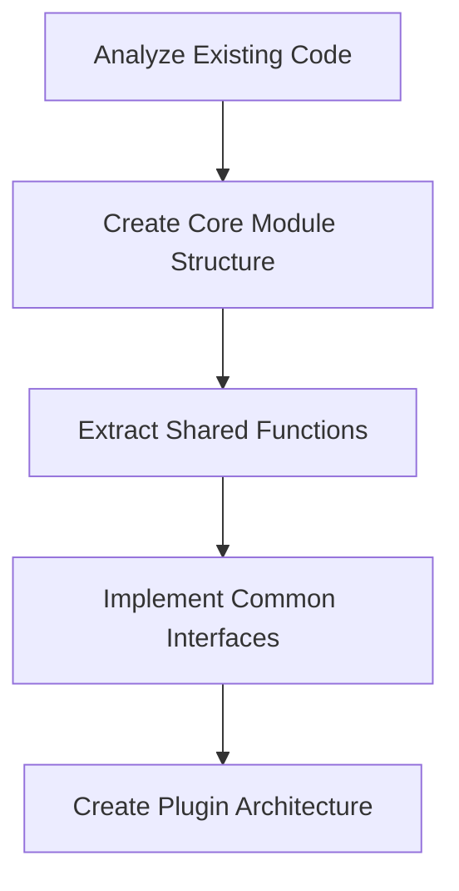
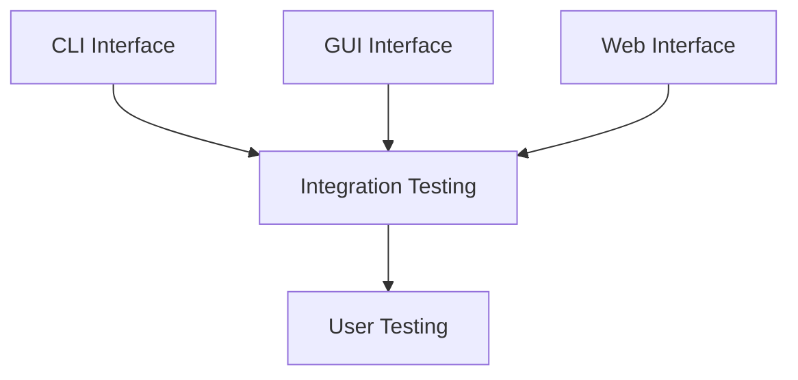
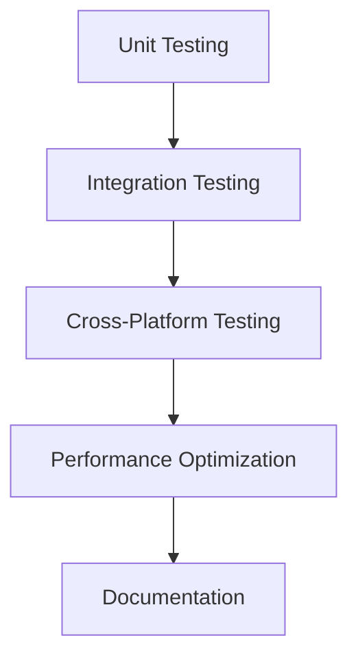

# Software Requirements Specification (SRS)
## AIO-SDMS (All-in-One System Diagnostic & Monitoring Suite)

**Document Version:** 1.0  
**Date:** October 1, 2025  
**Project:** AIO-SDMS Unified System Utilities  
**Author:** Srijan-XI  

---

## 1. Introduction

### 1.1 Purpose
This document outlines the requirements for developing a unified, cross-platform system diagnostic and monitoring tool that consolidates multiple hardware testing and system monitoring functionalities into a single application with multiple interface options (CLI, GUI, Web).

### 1.2 Scope
The All-in-One System Tools project aims to combine existing standalone utilities into a comprehensive system diagnostic suite that provides:
- Battery monitoring and charging analysis
- Hardware component diagnostics
- System performance monitoring
- Package management capabilities
- Multi-interface accessibility (Command Line, Desktop GUI, Web Browser)

### 1.3 Document Conventions
- **CLI**: Command Line Interface
- **GUI**: Graphical User Interface
- **API**: Application Programming Interface
- **OS**: Operating System

---

## 2. Problem Statement & Solution Overview

### 2.1 Problems This Project Solves

#### 2.1.1 **Fragmented System Diagnostics**
- **Problem**: Users need multiple separate tools for different diagnostic tasks
- **Solution**: Unified platform for all system diagnostic needs

#### 2.1.2 **Platform Inconsistency**
- **Problem**: Different diagnostic tools work differently across Windows/Linux
- **Solution**: Cross-platform compatibility with OS-specific optimizations

#### 2.1.3 **Interface Accessibility**
- **Problem**: Different users prefer different interfaces (technical users prefer CLI, general users prefer GUI)
- **Solution**: Multiple interface options for the same core functionality

#### 2.1.4 **Hardware Troubleshooting Complexity**
- **Problem**: Diagnosing hardware issues requires technical knowledge and multiple tools
- **Solution**: Automated diagnostic suite with clear reporting

#### 2.1.5 **Battery Life Management**
- **Problem**: Users lack detailed battery health and charging optimization information
- **Solution**: Comprehensive battery analysis with charging recommendations

#### 2.1.6 **System Performance Monitoring**
- **Problem**: System performance issues are hard to identify without proper monitoring
- **Solution**: Real-time system monitoring with historical data

---

## 3. Feasibility Analysis

### 3.1 Technical Feasibility ✅ **HIGH**

#### 3.1.1 **Code Reusability**
- **Status**: ✅ Excellent
- **Analysis**: Existing codebase already demonstrates modular architecture
- **Evidence**: 
  - BatteryMonitoringTool has 3 interface implementations
  - DeviceDiagnosticTool uses modular test components
  - Shared dependencies across tools

#### 3.1.2 **Technology Stack Compatibility**
- **Status**: ✅ Excellent
- **Core Technologies**: Python 3.x (proven, stable)
- **Hardware Access**: `psutil`, `opencv-python`, `sounddevice` (mature libraries)
- **Cross-Platform**: Existing Windows/Linux implementations work

#### 3.1.3 **Integration Complexity**
- **Status**: ✅ Low-Medium
- **Analysis**: Well-defined interfaces between components
- **Risk Mitigation**: Existing modular design reduces integration risks

### 3.2 Resource Feasibility ✅ **HIGH**

#### 3.2.1 **Development Resources**
- **Requirements**: 1 Developer (existing codebase owner)
- **Timeline**: 2-4 weeks for initial integration
- **Skills**: Python, Web Technologies, System Programming (already demonstrated)

#### 3.2.2 **System Requirements**
- **Minimal**: Python 3.7+, 100MB disk space, 256MB RAM
- **Dependencies**: All existing dependencies are lightweight and well-maintained

### 3.3 Market Feasibility ✅ **HIGH**

#### 3.3.1 **Target Users**
- **IT Professionals**: System administrators, technicians
- **Power Users**: Tech enthusiasts, developers
- **General Users**: Anyone needing system diagnostics
- **Organizations**: Small businesses, educational institutions

#### 3.3.2 **Competitive Advantage**
- **Multi-Interface Support**: CLI/GUI/Web in one package
- **Open Source**: Transparent, customizable
- **Lightweight**: No heavy dependencies
- **Cross-Platform**: Windows + Linux support

---

## 4. Project Workflow

### 4.1 Development Phases

#### 4.1.1 **Phase 1: Core Integration (Week 1-2)**


**Deliverables:**
- Core module architecture
- Shared utility functions
- Plugin system for tools

#### 4.1.2 **Phase 2: Interface Development (Week 2-3)**


**Deliverables:**
- Unified CLI interface
- Modern GUI application
- Web-based dashboard
- Interface switching mechanism

#### 4.1.3 **Phase 3: Testing & Optimization (Week 3-4)**


**Deliverables:**
- Test suite
- Performance benchmarks
- User documentation
- Deployment guides

### 4.2 Technical Workflow

#### 4.2.1 **Application Entry Point**
```
main.py
├── Interface Selection (CLI/GUI/Web)
├── Configuration Loading
├── Core Module Initialization
└── Tool Plugin Loading
```

#### 4.2.2 **Core Module Architecture**
```
core/
├── battery/           # Battery monitoring logic
├── diagnostics/       # Hardware diagnostic functions
├── monitoring/        # System monitoring utilities
├── package_mgmt/      # Package management functions
└── common/           # Shared utilities and interfaces
```

#### 4.2.3 **Interface Layer**
```
interfaces/
├── cli/              # Command-line interface
│   ├── commands/     # CLI command implementations
│   └── parsers/      # Argument parsing
├── gui/              # Desktop GUI interface
│   ├── windows/      # GUI windows/dialogs
│   └── widgets/      # Custom GUI components
└── web/              # Web interface
    ├── static/       # CSS, JS, assets
    ├── templates/    # HTML templates
    └── api/          # REST API endpoints
```

### 4.3 Data Flow Architecture

#### 4.3.1 **Information Flow**
```
User Input → Interface Layer → Core Modules → Hardware/System APIs → Results → Interface Layer → User Output
```

#### 4.3.2 **Configuration Management**
```
config.json
├── interface_preferences
├── tool_settings
├── hardware_profiles
└── monitoring_intervals
```

---

## 5. Functional Requirements

### 5.1 Core Functionality

#### 5.1.1 **Battery Management**
- Real-time battery percentage monitoring
- Charging status detection
- Charging time estimation based on charger specifications
- Battery health analysis
- Power consumption tracking

#### 5.1.2 **Hardware Diagnostics**
- Bluetooth device scanning and connectivity testing
- Wi-Fi network detection and signal strength analysis
- Camera functionality verification
- Microphone input testing
- Speaker/audio output testing
- Keyboard input detection
- Mouse/trackpad functionality testing

#### 5.1.3 **System Monitoring**
- CPU temperature monitoring
- Fan speed monitoring
- Memory usage tracking
- Disk space analysis
- Network interface monitoring

#### 5.1.4 **Package Management** (Windows)
- List installed packages
- Check for available updates
- Install/uninstall applications
- Source repository management
- Action logging and history

### 5.2 Interface Requirements

#### 5.2.1 **CLI Interface**
- Menu-driven navigation
- Command-line arguments support
- Batch operation capabilities
- Script-friendly output formats
- Progress indicators for long operations

#### 5.2.2 **GUI Interface**
- Modern, intuitive design
- Real-time data visualization
- System tray integration
- Customizable dashboards
- Export capabilities for reports

#### 5.2.3 **Web Interface**
- Responsive design for mobile/desktop
- Real-time updates via WebSocket
- RESTful API for external integration
- Multi-user session support
- Remote monitoring capabilities

---

## 6. Non-Functional Requirements

### 6.1 Performance Requirements
- **Startup Time**: < 3 seconds
- **Memory Usage**: < 100MB baseline
- **CPU Usage**: < 5% during idle monitoring
- **Response Time**: < 1 second for UI interactions

### 6.2 Reliability Requirements
- **Uptime**: 99.9% availability for monitoring functions
- **Error Recovery**: Graceful handling of hardware access failures
- **Data Integrity**: Accurate readings with error margins < 1%

### 6.3 Security Requirements
- **Local Access**: No network permissions required for basic functions
- **Data Privacy**: All diagnostic data stored locally
- **Web Interface**: Optional HTTPS support for remote access
- **Permissions**: Minimal system permissions required

### 6.4 Compatibility Requirements
- **Operating Systems**: Windows 10+, Ubuntu 18.04+, macOS 10.14+
- **Python Version**: 3.7+
- **Architecture**: x86_64, ARM64 support
- **Dependencies**: Minimal external dependencies

---

## 7. Success Metrics

### 7.1 Technical Metrics
- **Code Reuse**: > 80% of existing code successfully integrated
- **Performance**: No degradation compared to individual tools
- **Test Coverage**: > 90% code coverage
- **Cross-Platform**: 100% feature parity across supported platforms

### 7.2 User Experience Metrics
- **Interface Switching**: < 5 seconds to switch between interfaces
- **Learning Curve**: New users productive within 10 minutes
- **Documentation**: Complete user and developer documentation
- **Error Messages**: Clear, actionable error descriptions

---

## 8. Risk Analysis

### 8.1 Technical Risks

#### 8.1.1 **Hardware Access Limitations**
- **Risk**: Some hardware features may not be accessible on all platforms
- **Mitigation**: Graceful degradation, clear capability reporting
- **Impact**: Medium

#### 8.1.2 **Dependency Conflicts**
- **Risk**: Library version conflicts between different tools
- **Mitigation**: Virtual environment, dependency pinning
- **Impact**: Low

### 8.2 Development Risks

#### 8.2.1 **Complexity Underestimation**
- **Risk**: Integration more complex than anticipated
- **Mitigation**: Phased development, early prototyping
- **Impact**: Medium

#### 8.2.2 **Interface Consistency**
- **Risk**: Different interfaces providing inconsistent experiences
- **Mitigation**: Shared UI/UX guidelines, common testing scenarios
- **Impact**: Low

---

## 9. Future Enhancements

### 9.1 Short-term (3-6 months)
- Plugin system for third-party tools
- Mobile companion app
- Cloud synchronization for settings
- Advanced reporting and analytics

### 9.2 Long-term (6-12 months)
- Machine learning for predictive diagnostics
- Enterprise management features
- API for third-party integration
- Multi-language support

---

## 10. Conclusion

The All-in-One System Diagnostic & Monitoring Tools project represents a natural evolution of the existing Z-TOOLS collection. With high technical feasibility, clear market demand, and existing proven components, this project has excellent potential for success.

The unified approach will solve real problems for users while leveraging the substantial investment already made in the individual tools. The phased development approach ensures manageable risk while delivering value incrementally.

**Recommendation**: Proceed with development as outlined in this specification.

---

**Document Status**: Draft  
**Next Review Date**: After Phase 1 Completion  
**Approval Required**: Project Owner (Srijan-XI)